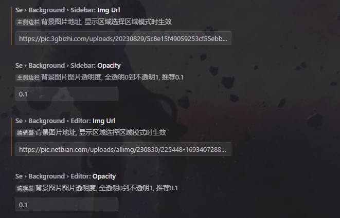
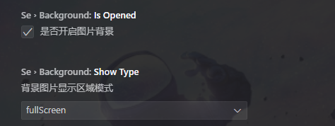
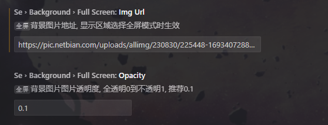
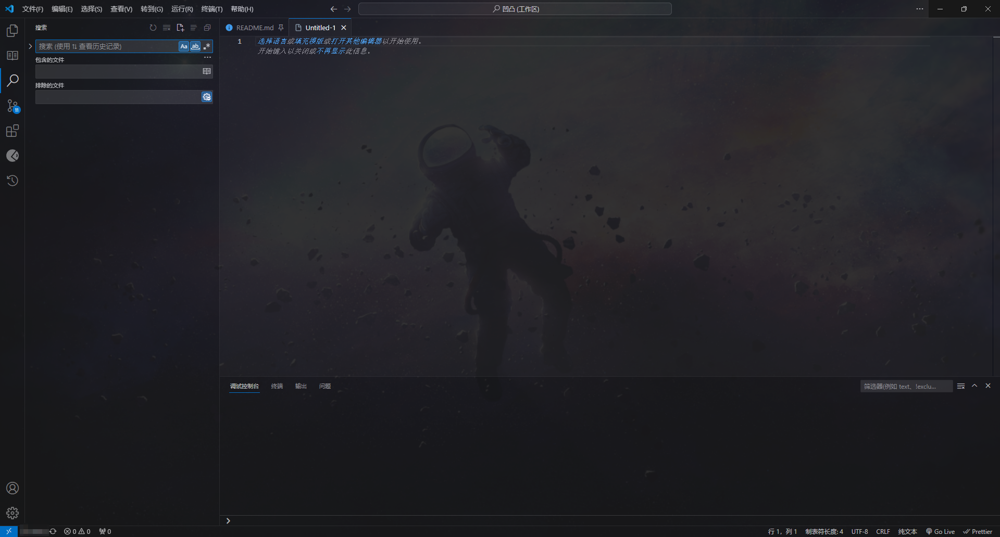

# Background

改变设置后需要重启生效

## 定义每个区域的背景图片

开启背景图片功能，选中 `partition` 模式

配置各个区域的背景图片路径（本地地址，base64或者网页地址）和透明度。

结果展示：

## 定义全屏背景图片

开启背景图片功能，选中 `fullScreen` 模式

配置背景图片路径（本地地址，base64或者网页地址）和透明度。

结果展示：

