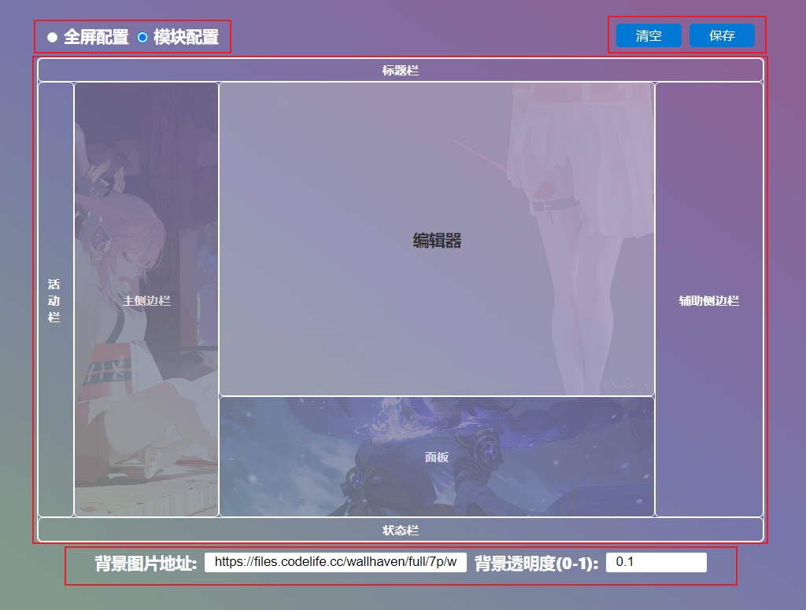

# VsBackground

为页面添加全屏背景或区域背景。

## 配置方式

### 可视化页面中配置

插件生效后可通过命令 'changeBackground' 或点击下方状态栏 ❤️ 图标（如果下方状态栏没有图标可以右键检查是否隐藏）打开可视化页面进行配置。



- 左上方设置背景显示模式。
- 右上方可清空或保存设置。
- 中间可以实时查看配置的图片并突出显示当前配置的区域。
- 下方可输入背景图片地址和透明度。

> 在配置前建议先清空背景，方便观察设置效果。

### 配置文件中配置：

```json
{
    // ...
    "vsbackground": {
        // partition: 分区域配置；	full: 全屏配置。
        "showType": "partition",

        // 全屏配置。showType 为 full 是生效。
        "full": {
            // 图片地址。
            "img": "",
            // 图片透明[0, 1]。
            "opacity": 0.05
        },

        // 分区域配置。showType 为 partition 是生效。
        // 标题栏
        "titlebar": { "img": "", "opacity": 0.05 },
        // 活动栏
        "activitybar": { "img": "", "opacity": 0.05 },
        // 主侧边栏
        "sidebar": { "img": "", "opacity": 0.05 },
        // 编辑区
        "editor": { "img": "", "opacity": 0.05 },
        // 面板
        "panel": { "img": "", "opacity": 0.05 },
        // 辅助侧边栏
        "auxiliarybar": { "img": "", "opacity": 0.05 },
        // 状态栏
        "statusbar": { "img": "", "opacity": 0.05 }
    }
}
```

## 注意

- 透明度建议不要设置太高，否则可能无法看清页面。
- 改变设置后需要重启生效。
